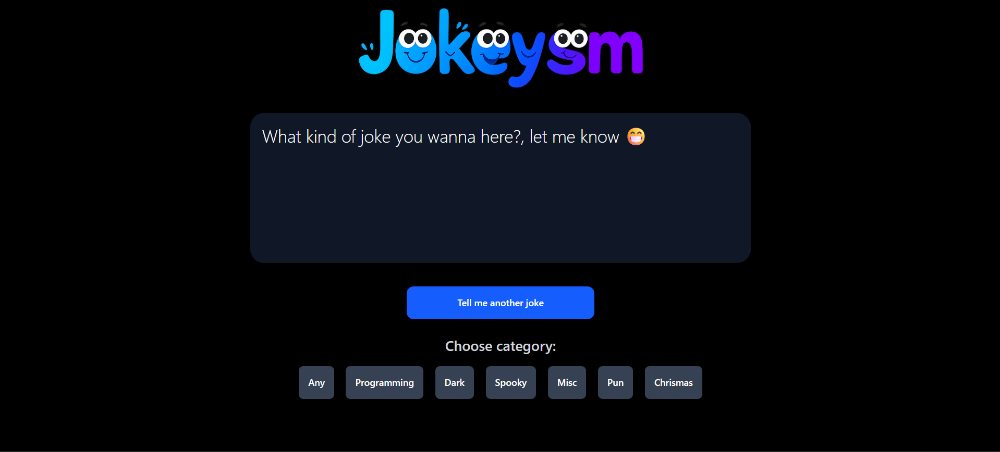

# 😂 Jokeysm

**Jokeysm** is a fun joke-generating web app that fetches random jokes using the [JokeAPI](https://v2.jokeapi.dev). Users can enjoy a variety of jokes by category and get a good laugh every time they click the button.

---

## Features

 Random jokes on button click    
 Category-based jokes: Programming, Dark, Spooky, Pun, Christmas, etc.  
 Clean UI with Tailwind CSS  
 Funny and engaging layout using EJS

---

##  Tech Stack

- **Node.js**
- **Express.js**
- **EJS** (Embedded JavaScript)
- **Tailwind CSS**
- **JokeAPI** (for fetching jokes)

---

##  What I Learned

I created this project to learn how to integrate an external API using **Axios** in a Node.js + Express.js environment. It helped me understand how data flows from an API into a dynamic EJS frontend and how to structure a basic full-stack app.

---

## 📸 Screenshot



---

## 🛠️ Setup Instructions

1. **Clone the repository**
   ```bash
   git clone https://github.com/Adityanaik4545/jokeysm.git
   ```
   
2. **Change directory**
   ```bash
   cd jokeysm
   ```
   
3. **install packages**
   ```bash
   npm i
   ```
4. **run server**
   ```bash
   npm run dev
   ```
5. **open browser and go to**
   ```bash
   http://localhost:3000
   ```
